GoMarsys Workshop 3.
====================

# Gotcha

> a gotcha is a valid construct in a system, program or programming language that works as documented but is counter-intuitive and almost invites mistakes because it is both easy to invoke and unexpected or unreasonable in its outcome (source: [wikipedia](https://en.wikipedia.org/wiki/Gotcha_(programming)))

## Visualization

### [Basic Types](img/basic_types.png)

### [Passing by value](img/func_params.png)

### [Pointers](img/pointers.png)

### [Pointers](img/pointers.png)

### [Pointers](img/pointers.png)

### Arrays

Arrays are just continuous blocks of memory.
You may see that creating an array is essentially an allocating a piece of memory of the given size.

```go
Arrays
var arr [5]int
var arr [5]int{1,2,3,4,5}
var arr [...]int{1,2,3,4,5}
```

It means that we can simply represent array as a set of blocks in memory sitting next to each other

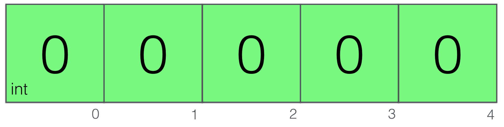

```go
var arr [5]int
arr[4] = 42
```
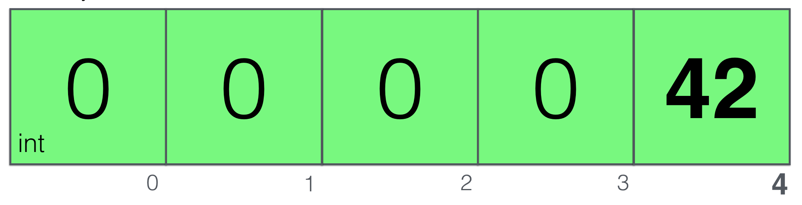

### Slices

feels Similar to array, but without predefined maximum size

```go
var foo []int
```

When you create a new slice, Go runtime will create this three-blocks’ object in memory with the pointer set to nil and len and cap set to 0.

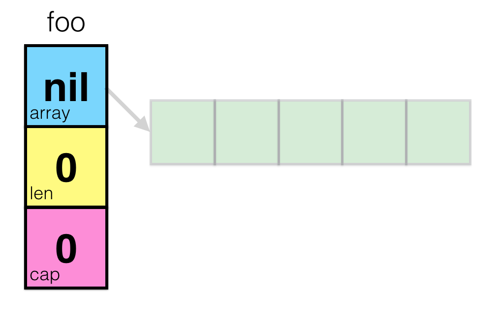

by using the make built-in, we can create an **underlying Array**

```go
var foo []int
foo = make([]int, 5)
```

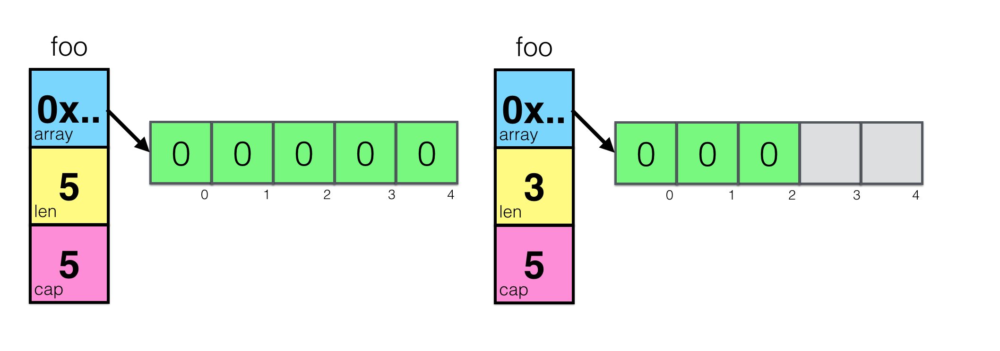

With the same use as array, you can update it's underlying array content

```go
foo := make([]int, 5)
foo[3] = 42
foo[4] = 100
```

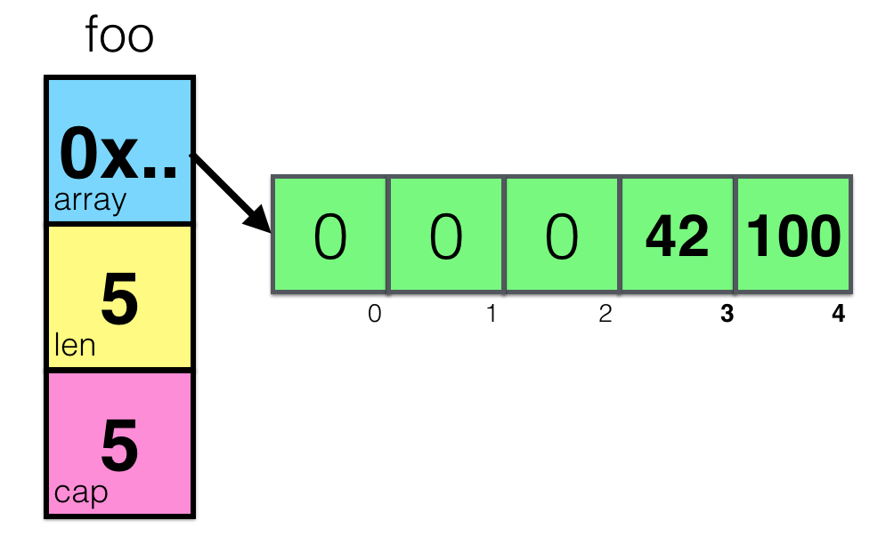

By slicing the slices or arrays, we create a new pointer type struct, a new slice
that has the reference to the same underlying array but with an explicit range selection only

```go
foo := make([]int, 5)
foo[3] = 42
foo[4] = 100

bar  := foo[1:4]
bar[1] = 99
```

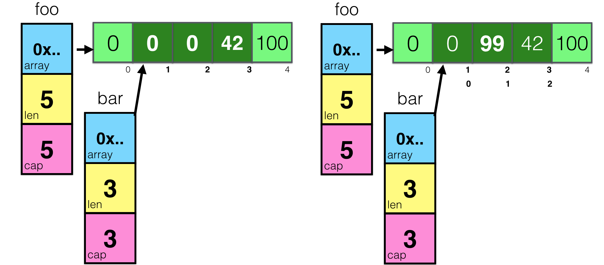

**One common mistake is with working with files:**

```go
var digitRegexp = regexp.MustCompile("[0-9]+")

func FindDigits(filename string) []byte {
    b, _ := ioutil.ReadFile(filename)
    return digitRegexp.Find(b) // return a slice of byte that has match to the regular expression
}
```

By reading let’s say 10MB of data into slice and searching for only 3 digits, you may assume that you’re returning 3 bytes, but, in fact, the underlying array will be kept in memory, no matter how large it is.

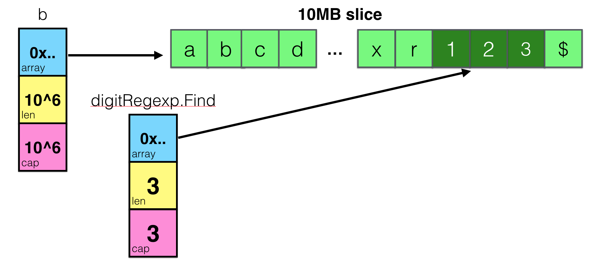

### Append

It essentially does one operation - appends a value to the slice.
But internally it does a lot of complex stuff, allocating memory in a smart and efficient way if needed.

```go
a := make([]int, 32)
a = append(a, 1)
```

Allocating memory is a quite expensive operation, so append tries to anticipate that operation and asks not for 1 byte, but for 32 bytes more - twice as large as the original capacity.

Append grows slice by doubling it’s capacity only up to 1024, after that it will use so-called memory size classes to guarantee that growth will be no more than ~12.5%. Requesting 64 bytes for 32 bytes array is ok, but if your slice is 4GB, allocating another 4GB for adding 1 element is quite expensive, so it makes sense.

Creating a new underlying array with the new capacity result in creating a new memory allocation.
The new return slice from now on will point to a new underlying array therefore.

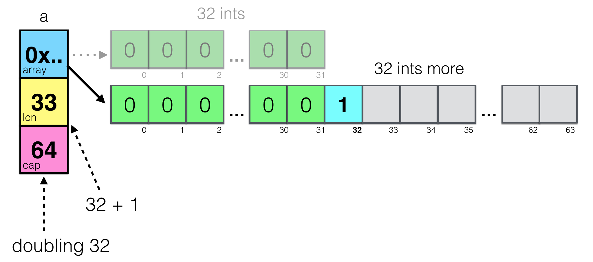

Doesn’t look like a possible gotcha, right?

What if you create subslice **b**, then append a value to **a**,
assuming they both share common underlying array?

```go
a := make([]int, 32)
b := a[1:16]
a = append(a, 1)
a[2] = 42
```


### Interfaces

One of the sources of confusion is a different meaning of nil keyword in the context of interfaces.

To help understand this subject, let’s again take a look at the Go source code. What is interface under the hood?

```go
type iface struct {
    tab  *itab
    data unsafe.Pointer
}
```

itab stand for interface table and is also a structure that holds needed meta information about interface and underlying type:

```go
type itab struct {
    inter  *interfacetype
    _type  *_type
    link   *itab
    bad    int32
    unused int32
    fun    [1]uintptr // variable sized
}
```

What is important is to understand that interface is a compound of interface and static type information plus pointer to the actual variable (field data in iface).

```go
var err error // err variable with error interface
```

[Nil Interface](img/iface1.png)

When you return nil in the function with return type error, you are returning this object.

It has information about interface (itab.inter), but has **nil in data** and itab.type fields

```go
if err == nil {} // true
```

```go
func foo() error {
    var err error // nil
    return err
}

err := foo()
if err == nil {...} // true
```

> famous gotcha is to return a \*os.PathError variable which is nil

```go
func foo() error {
    var err *os.PathError // nil
    return err
}

err := foo()
if err == nil {...} // false
```


You can clearly see the \*os.PathError variable - it’s just a block of memory holding nil value because it’s the zero value for pointers.

But the actual error that we return from foo() is a much complex structure with information about the interface, about the underlying type and the memory address of that block of memory, holding nil pointer

> difference between “have an interface with a variable which value equals to nil” and “interface without variable”

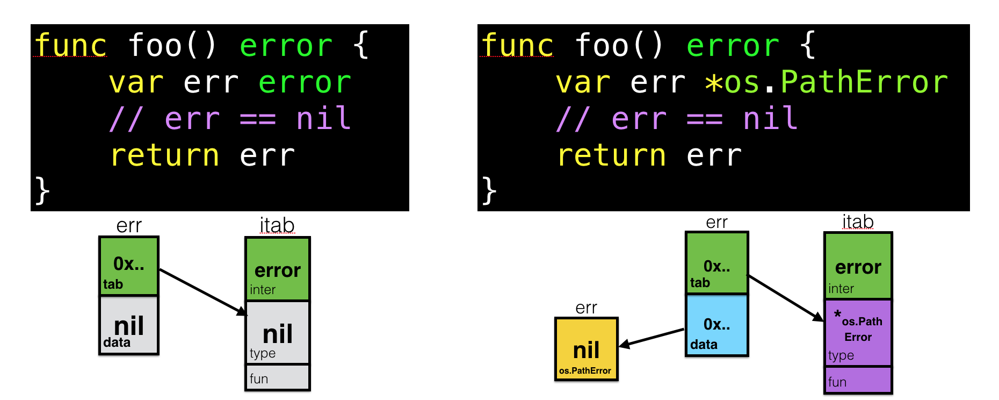

#### Empty interface

The interface{} type, the empty interface is the interface that has no methods.

Since there is no implements keyword, all types implement at least zero methods,
and satisfying an interface is done automatically, **all types satisfy the empty interface.**

source implementation:
```go
type eface struct {
    _type *_type
    data  unsafe.Pointer
}
```

lacks interface table

```go
func foo() interface{} {
    foo := int64(42)
    return foo
}
```

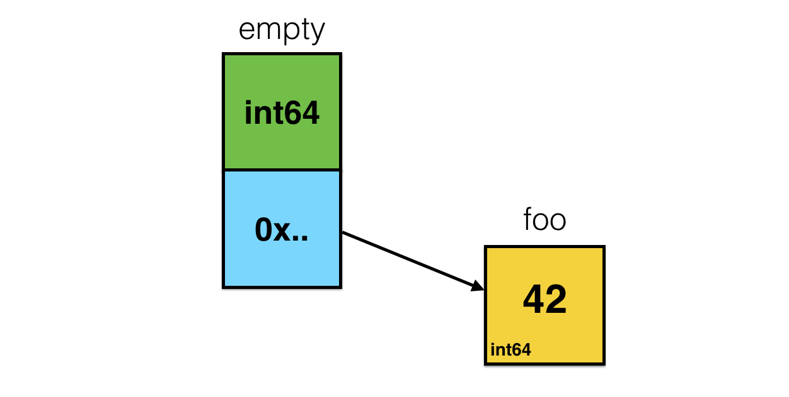

One of the interface{} related gotchas is the frustration that you can’t easily assign slice of interfaces to slice of concrete types and vice versa.

```go
func foo() []interface{} {
    return []int{1,2,3}
}
```

You’ll get compile time error:

```
$ go build
cannot use []int literal (type []int) as type []interface {} in return argument
```

This “conversion” is actually a quite expensive operation which involves allocating a bunch of memory and is around O(n) of time and space. And one of the common approaches in Go design is “if you want to do something expensive - do it explicitly”.

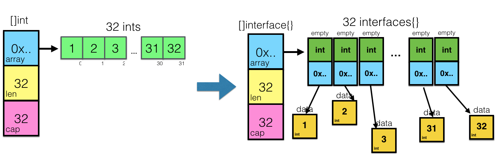
